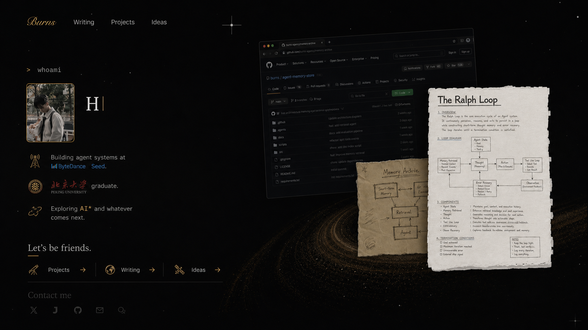
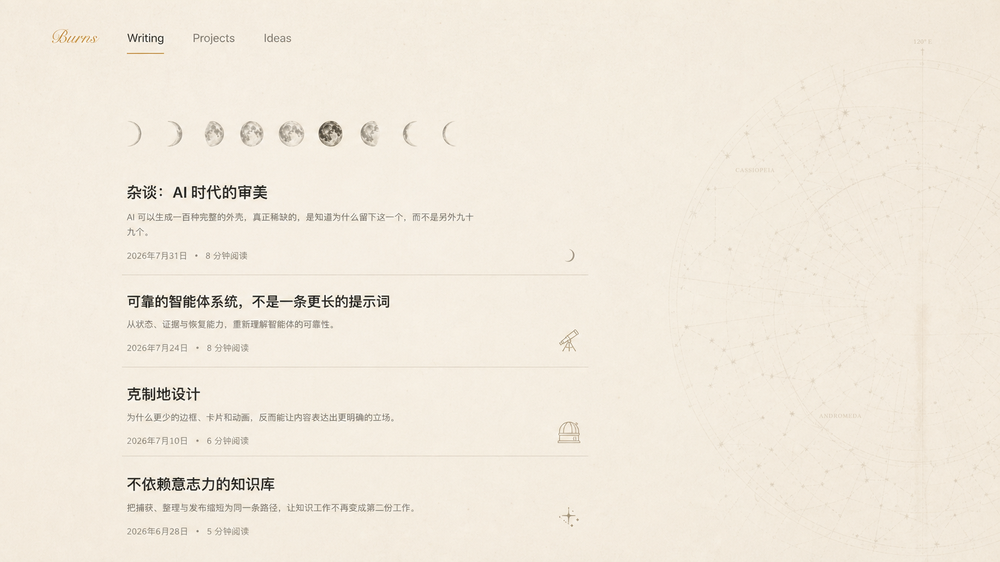
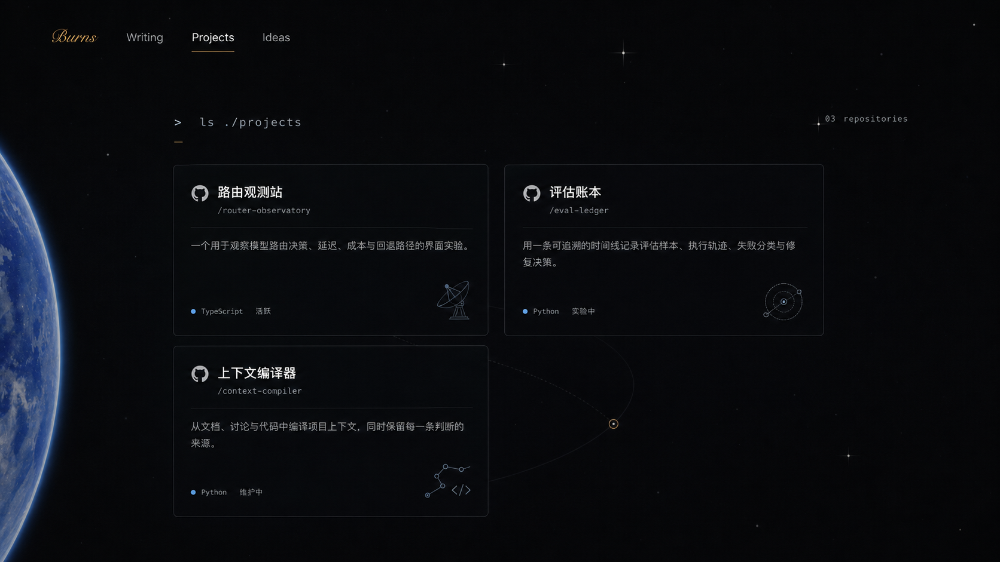
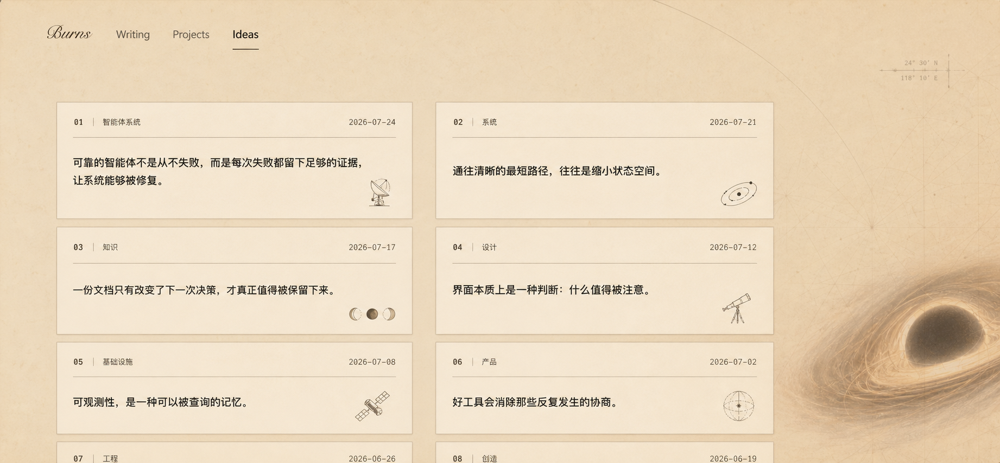

# Burns’ Blog 宇宙设计语言

状态：视觉方向已确认，四页效果图为第一轮概念稿；当前只归档设计，不实施页面改动。

## 1. 核心命题

Burns’ Blog 不是一个“带宇宙装饰的个人网站”。宇宙意象必须解释页面正在发生的事。

四个主界面对应四种不同的关系：

- Home：我与我的产物——三件产物停留在土星环上。
- Writing：写作与夜晚——实时月相记录此刻写作所处的夜晚。
- Projects：开发与未知——从地球出发，进入地球之外的前沿空间。
- Ideas：灵感与引力——想法必须逃离黑洞般的既有结论，才成为真正的灵感。

因此，页面之间共享的是审美语法，不是同一套装饰素材。每一页只保留一个主宇宙意象，其余小元素必须服务于这个意象。

## 2. 共享视觉语法

### 2.1 留白就是空间

留白不是尚未填满的区域，而是宇宙中的距离。每个首屏都要先建立主意象与内容之间的空间关系，再安排信息。禁止为了“精美”填满所有空白。

- 首屏必须存在一块可感知的安静区域。
- 主内容和主意象之间保留清晰缓冲带。
- 同一视口内最多出现一个大型宇宙物体。
- 小图标不漂浮；它们必须锚定一条信息、一个入口或一个状态。

### 2.2 意象先于装饰

新增元素必须回答两个问题：它代表什么；为什么只应出现在这一页。回答不了的元素不进入页面。

- 主意象：负责解释页面主题，例如土星环、月相、地球边缘、黑洞。
- 语义仪器：负责解释局部内容，例如望远镜、观测站、卫星、轨道坐标。
- 环境纹理：只负责形成材料感，例如星图、纸张、稀疏星点，透明度必须低。

### 2.3 材料与颜色

页面使用两组材料，但保持同一品牌气质。

- 夜色页面：近黑、石墨灰、暗金、冷银和极少量地球蓝。适用于 Home、Projects。
- 纸张页面：暖象牙、旧纸、烟灰、赭石和褐色线稿。适用于 Writing、Ideas。

暗金只用于方向、强调和人与内容之间的联系；不能成为大面积高亮色。蓝色只用于技术状态、地球或远方信号。

### 2.4 图标规则

图标是一件观测仪器或语义印章，不是贴纸。

- 常规尺寸为 18–28 px，单色线稿，低对比度。
- 同一信息单元最多一个辅助图标。
- 同页图标共享线宽、光照与材料，但不强制使用相同轮廓。
- 品牌标记不能被生成图替代：GitHub 项目始终使用 Octocat。
- 月相必须是完整、可辨认的单个月相，禁止多个月相混杂裁切。
- 图标不能覆盖正文，不能单独制造点击暗示。

### 2.5 动态规则

动态必须表达时间、距离或引力，不能只表达“页面很酷”。

- 土星环、地球和黑洞只允许极慢运动。
- 月相由真实日期计算，不做无意义循环。
- Ideas 的轨迹只表达信号逃逸，不做持续飞散的粒子雨。
- 页面切换时暂停持续绘制，过渡完成后再恢复。
- 移动端、省流量与减少动态模式保留静态构图。

## 3. 四个页面

### 3.1 Home：土星环上的产物

Home 的核心不是展示宇宙，而是展示“我”和“我留下的东西”。

- 左侧固定为个人介绍：头像、自我描述、经历、去往三个栏目和联系方式。
- 右侧固定为三件产物：代码仓库、文稿、手绘想法。
- 三件产物坐落在同一条土星环上，土星环是它们之间的共同轨道，不是背景特效。
- 左右之间保留大块黑色空间，让“人”与“产物”形成距离和牵引。
- 小图标只用于解释现有信息，例如工作信号、探索方向和三个栏目入口。
- 现有首页已经建立了成熟构图；后续只做间距、细节一致性和小图标精修，不重做主场景。

禁止增加第四件大型物体、第二颗行星或覆盖三件产物的 HUD。

### 3.2 Writing：月相中的夜间写作

Writing 的月相不是装饰，而是一件时间仪表：它告诉作者和读者，此刻的夜晚处于什么阶段。

- 月相序列是首屏的仪式性入口；当前月相根据真实日期标记。
- 每个月相必须独立、完整、可辨认。
- 文章列表保持单列，不卡片化，阅读优先于视觉展示。
- 文章之间使用充足垂直间距和细线分隔。
- 右侧星图退为低对比度环境，不进入主要文字区域。
- 每篇文章最多有一个极小的夜间仪器图标，用于形成节奏，不用于分类堆叠。
- 文章详情页只在首屏保留月球意象；进入长正文后保持干净纸面，不给正文铺持续背景。

禁止把月相做成连续混合图案，也禁止在文章正文下面反复出现大型月球纹理。

### 3.3 Projects：地球之外的未知

Projects 的视角已经离开地球。地球是出发点和尺度参照，项目位于更远的未知空间。

- 地球只从最左侧露出被裁切的边缘，不占据内容中心。
- 地球与项目网格之间必须有一段黑色缓冲区，表达离开地表的距离。
- 项目卡片像空间中的观测节点，使用两列疏朗网格。
- 每张卡片保留 GitHub Octocat 作为仓库身份。
- 次级图标解释项目的探索方式：路由观测站使用射电望远镜，评估账本使用校准轨道，上下文编译器使用星座节点。
- 可以有一条非常淡的轨道线穿过卡片之间的空白，但不能把页面变成控制台 HUD。
- 地球慢速自转与稀疏星场可以保留；不可见时停止绘制。

禁止在右侧恢复文稿、浏览器截图等首页三件产物；Projects 需要把右侧留给未知空间。

### 3.4 Ideas：逃离黑洞的信号

Ideas 的黑洞代表既有结论、惯性和确定性产生的引力。灵感不是围绕黑洞旋转，而是达到逃逸速度后被记录下来的信号。

- 黑洞位于最右侧并被视口裁切，形成构图边界，不进入卡片正文。
- 古星图代表既有知识；灵感卡片是从知识与引力中捕获的独立信号。
- 卡片网格保持两列，但整体收窄，并显著增加首屏留白、列间距、行间距和内部边距。
- 每张卡片只使用一个主题相关的天文线稿印章，替代重复的 `#` 与重复轨道章。
- 黑洞周围可以有极慢吸积盘运动；灵感轨迹只在进入页面时短暂表达一次逃逸方向。
- 地图对比度低于卡片，黑洞视觉重量低于第一行内容。

禁止让黑洞贴近或覆盖文字，也禁止用大量飞散粒子直接表现“灵感爆发”。

## 4. 页面关系矩阵

| 页面 | 主意象 | 关系 | 内容材料 | 局部仪器 | 动态含义 |
| --- | --- | --- | --- | --- | --- |
| Home | 土星环与三件产物 | 我与产物 | 夜色、实物剪贴 | 信号、探索、栏目入口 | 产物共享轨道 |
| Writing | 实时月相 | 写作与夜晚 | 纸张、月相、星图 | 望远镜、观测站、月牙 | 时间变化 |
| Projects | 地球边缘 | 已知与未知 | 深空、仓库卡片 | 射电望远镜、校准轨道、星座节点 | 离开地表、继续探索 |
| Ideas | 黑洞 | 引力与逃逸 | 古星图、档案卡片 | 卫星、坐标、轨道、月相 | 信号达到逃逸速度 |

## 5. 密度与响应式边界

- 桌面端以 1440–2048 px 的宽屏构图为基准，但内容不能依赖超宽屏才成立。
- 1024–1439 px：缩小主意象，保持内容间距，不通过塞紧卡片解决空间不足。
- 621–1023 px：两列内容可改为单列；主意象移到边缘并增加裁切。
- 620 px 以下：主意象只保留最能识别主题的一部分；辅助图标数量减半；持续动画改为静态。
- 无论尺寸如何，正文、标题和操作区域都不能覆盖在高对比度宇宙纹理上。

## 6. 实施顺序

后续实施应按风险从低到高推进：

1. 先调整 Ideas 的留白、网格和黑洞位置，因为该页方向已经明确。
2. 再为 Writing 固化月相时间仪表与文章节奏，保持详情页正文干净。
3. 再为 Projects 增加项目专属仪器图标并精修地球与网格的距离。
4. 最后只对 Home 做克制精修，保护现有土星环与三件产物构图。
5. 完成桌面、平板、移动端及减少动态模式的视觉回归后，再决定是否扩展到详情页。

任何实现如果让页面更满、更亮、更像通用科幻 UI，或削弱四页之间的叙事差异，都应视为偏离本规范。
