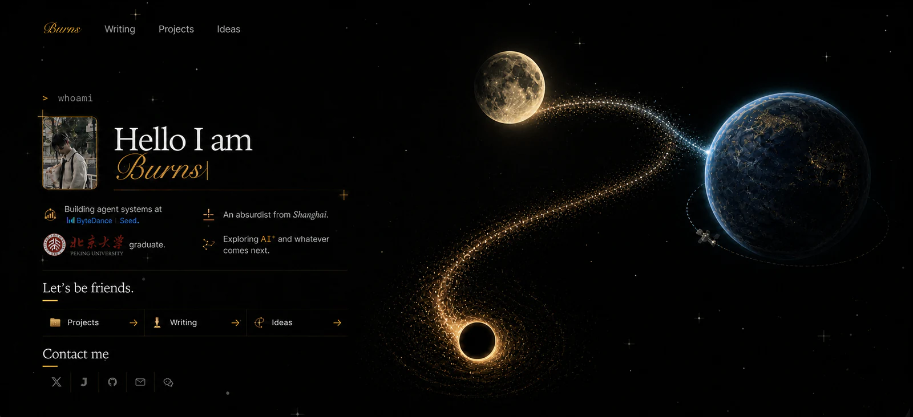

# 首页思想星系动画设计

## 目标

首页右侧以一个连续的思想星系承载三个入口：Ideas 对应黑洞，Writing 对应月球，Projects 对应地球。视觉关系是两股不对称粒子流共同汇入地球：黑洞发出宽暖金主流，月球发出窄珍珠蓝支流；不再使用穿过三颗星体的串联线或与轨道混杂的土星环。

这次改造保留左侧个人介绍、深空底图、导航、现有页面展开动画和地球旋转效果。改造重点是提高三颗天体的精致度，建立统一而克制的运动语言，并维持低负载设备上的可读性和流畅度。

## 已确认视觉母版

施工以此图为构图与质感基准：黑洞与月球的两条支流在地球左缘汇合；地球的卫星轨道保持独立，不替代主连接，也不与主粒子流形成闭合圆环。

## 视觉构图

- 黑洞位于右侧视觉区域左下方，作为粒子流的起点。
- 月球位于右侧视觉区域上方，粒子流从其下缘与右缘掠过。
- 地球位于最右侧，粒子流以冷蓝色稀疏粒子汇入其左侧大气边缘。
- 地球自己的卫星轨道是局部次级元素，不承担三颗天体之间的连接。
- 两条粒子流保持开放、有体积且具有负空间，禁止闭合成椭圆、土星环或互相穿越。
- 黑洞支流从暖金渐变到冷蓝；月球支流从珍珠白渐变到冷蓝，并在地球左缘同点收束。

## 技术方向

采用“不可变静态母版 + 无缝球面纹理 + 原生 WebGL”的混合方案，不使用循环视频，也不再使用离散图片帧交叉淡化。

当前静态月球和地球是视觉基准，不重新生成整颗星球，不改变其亮度、色调、轮廓、阴影或定向辉光。ImageGen 只用于补全母版中不可见的侧面与背面纹理；可见正面区域必须来自现有母版。WebGL 仅让内部球面纹理持续改变经度，固定光照和辉光继续由独立静态层负责。

静态素材负责首屏加载、降级状态与固定光场；WebGL 负责月球和地球的连续表面自转；受控 Canvas 粒子层负责连接线流动。所有动态能力继续服从首页已有的 `data-motion-running` 生命周期：离开视口、页面隐藏、开始导航、开启减少动态效果或启用省流量模式时暂停。

视觉母版只用于校准构图、尺寸、连接路径和定向光场，禁止作为运行时背景或跟随天体运动的裁切图。每颗天体必须由“纹理 / 固定光照 / 固定轮廓”独立构成，展开动画只能携带对应天体，不能携带母版黑底或其他星体。

## 现有素材复用结论

- 直接复用：`home-cosmos-satellite-v2` 与现有 v3 群星底图。
- 母图确定性拆层：`home-orrery-writing-moon-v4`、`home-orrery-projects-earth-v4`、`home-orrery-projects-earth-glow-v4`、`home-orrery-ideas-core-v4`、`home-orrery-ideas-field-v4`、`home-orrery-connection-base-v4`。
- 继续复用：现有 v3 群星底图与星点动画，不重新生成深空背景。
- 程序生成：两条支流上的少量活动粒子；静态尘埃体积由母图透明拆层保证视觉一致。
- 明确废弃：`approved-scene-v9`、`*-inner-v11` 黑底裁切，以及 `home-orrery-*-frame-v5-*` 离散转动帧。它们不得出现在运行时清单或组件中。
- 母图中有用的信息不是整张图片，而是三颗天体的位置比例、S 形路径、地球左缘蓝色连接光以及黑洞吸积盘的非均匀外场；这些分别用独立层还原。

## 素材分层

### 共享星系

1. `connection-base`：从母图按两条支流走廊提取的透明基准层，确保暂停时仍与批准稿一致。
2. Canvas 分别沿黑洞→地球和月球→地球的归一化贝塞尔路径绘制少量活动粒子。
3. 两条路径只在地球左缘汇合，不在月球或黑洞中心串联。

### 月球

1. 从母图无透明边距裁出的月球继续作为静态回退与视觉校准帧。
2. 以现有月表正面为锁定区域，生成一张无缝球面纹理；ImageGen 只补全不可见区域，并对生成区域做亮度、色温和对比度匹配。
3. 原生 WebGL 将无缝纹理映射到球体并持续改变经度；任何时刻只渲染一个表面采样，不叠加相邻帧。
4. 固定阴影与定向辉光层保持球体明暗稳定，避免均匀发光和硬描边。

月球不直接旋转整张圆形图片，也不使用透明帧混合。只有球面经度持续变化，轮廓和光照始终固定，从而产生真实的缓慢自转感。

### 地球

1. 从母图裁出的深靛蓝与金色裂纹地球继续作为静态回退与视觉校准帧。
2. 以现有正面纹理为锁定区域，补全无缝球面纹理；禁止重新解释金色裂纹密度、蓝黑色阶或表面材质。
3. 原生 WebGL 只转动内部表面纹理，不改变星体外轮廓和页面位置。
4. 从母图单独提取的左上定向大气辉光保持固定；右侧和下缘不补均匀光圈。
5. 精细卫星透明素材继续作为独立层。

地球不再使用 `24` 张图片帧、镜像折叠或交叉淡化。现有静态母版的构图与光暗不变，WebGL 只提供连续、单向、低速的表面自转。

### 黑洞

1. 独立且静止的暗核。
2. 透明内层吸积盘单独旋转。
3. 透明的非均匀外层吸积尘埃保持固定，保留母图左上更强、下方更弱的外场方向。

暗核始终稳定；内层顺时针慢转，外层定向尘埃场保持固定。主粒子流从吸积盘自然甩出，不在黑洞周围形成额外的大型闭环。

## 动画节奏

### 主粒子流

- 桌面端约 28 个活动粒子，移动端约 12 个。
- 粒子分别沿两条归一化贝塞尔路径从黑洞/月球移动到地球，单次行程约 11–21 秒，并通过不同延迟形成连续流动。
- 粒子在路径法线方向具有少量扰动，不能形成机械等距点阵。
- 黑洞支流颜色为暖金 → 冷蓝；月球支流颜色为珍珠白 → 冷蓝。
- Canvas 最高以 30fps 绘制，设备像素比封顶为 1.5。

### 月球

- 月表纹理以单一方向持续自转，完成一周约 `180` 秒。
- 月球容器、轮廓和光照的 `transform` 始终为 `none`，不再上下漂浮或跟随鼠标位移。
- 辉光固定，不随纹理移动，避免再次形成虚影或均匀光圈。
- 每一帧只采样一个经度，不使用相邻画面的透明交叉淡化。

### 地球

- 地表以单一方向持续自转，完成一周约 `150` 秒，不加速成模型展示。
- 大气辉光与地球左缘连接光固定，只让地表在其下方移动。
- 地球容器、轮廓和光照的 `transform` 始终为 `none`。
- 卫星沿局部轨道进行约 `18–24` 秒的缓慢漂移；悬停 Projects 时不改变运行轨迹。

### 黑洞

- 内层吸积盘约 32–40 秒顺时针旋转。
- 外层尘埃保持固定，保留左上强、下方弱的非均匀方向。
- 光子环只做极弱的亮度脉冲，不缩放暗核。

## 交互反馈

- 悬停或键盘聚焦天体时不额外放大，只提高少量亮度，避免破坏三角构图。
- 其他天体最低保持 `0.82` 透明度，不允许因选中态过暗。
- 不显示圆形选中描边；仅为键盘 `focus-visible` 保留符合无障碍要求的细轮廓。
- 悬停 Writing 时只提高月球少量亮度，纹理继续保持原有慢速。
- 悬停 Projects 时只提高少量亮度；卫星维持自己的缓慢漂移，地球不产生位置或尺寸变化。
- 悬停 Ideas 时只提高吸积盘少量亮度，不放大暗核。
- 主粒子流不中断。悬停只增强对应天体附近的一小段路径。

## 生命周期与性能

- 复用 `HomeOrrery.astro` 现有的 `IntersectionObserver`、`visibilitychange`、`prefers-reduced-motion`、`saveData` 和导航暂停机制。
- Canvas 与所有 CSS 动画由同一个运动状态控制，不能出现页面隐藏后仍持续绘制的后台动画。
- 首屏关键静态素材使用 `480/960` 两档 WebP；球面纹理使用带 Mipmap 的 WebGL 纹理，并限制在设备合理分辨率内；大幅粒子底层使用 `960/1600` 两档 WebP。
- 近景粒子与高分辨率素材继续延迟加载；移动端不加载桌面近景雾层。
- 桌面 v4 对齐素材预算控制在 1MB 以内，移动端控制在 520KB 以内。
- 使用浏览器原生 WebGL，不增加第三方运行时依赖；WebGL 初始化失败时保留现有静态母版。

## 响应式策略

- 宽屏保持黑洞左下、月球上方、地球右侧的三角关系。
- 中等宽度缩短月球至地球的粒子段，地球向右裁切，但仍显示粒子汇入其左缘。
- 移动端保留三颗天体与主连接的局部构图，降低粒子数量和辉光，不缩小正文触控区域。
- `prefers-reduced-motion: reduce` 与省流量模式只显示静态连接底图和天体，不启动纹理滚动、粒子 Canvas 或吸积盘旋转。

## 代码边界

- `HomeOrrery.astro`：语义结构、WebGL/Canvas 容器和运动生命周期。
- `home-orrery.css`：天体布局、素材分层、CSS 动画和响应式规则。
- `home-orrery-assets.ts`：所有生成素材的唯一清单。
- `build-home-orrery-assets.mjs`：离线读取视觉母版，确定性重建独立透明天体、无缝球面纹理、定向光场和双支连接层；禁止输出整张母图作为运行时素材。
- 独立球面渲染模块：只接收 WebGL Canvas、球面纹理、固定自转周期和运行状态，不读取交互高亮或页面布局状态。
- 独立粒子模块：只接收 Canvas、路径控制点、运行状态和活动入口，不读取页面其他状态。

## 测试与验收

### 自动化测试

- 三颗天体仍分别链接到 Writing、Projects 和 Ideas。
- 粒子层只存在一个动画循环，并服从 `data-motion-running`。
- 月球和地球只存在一个连续球面采样，不存在离散帧混合、镜像折叠或往返摆动。
- 星体容器在悬停前后的坐标、尺寸和 `transform` 完全一致。
- 省流量、减少动态效果、页面隐藏、离开视口和导航开始时动画暂停。
- 所有生成素材满足尺寸、透明通道和字节预算。
- 选中状态无圆形描边，未选中天体透明度不低于 `0.82`。
- 构建、类型检查和现有内容测试全部通过。

### 视觉验收

- 第一眼可以看出黑洞、月球、地球由同一条粒子流连接。
- 不存在宽大土星环、闭合主轨道或多条路径交叉。
- 三颗天体在静止截图中也具有统一质感，且比现有素材精细。
- 动画启动前的月球和地球与现有静态母版视觉一致，不出现整体提亮、色偏或材质重绘。
- 月球和地球无时无刻保持极慢、单向、连续的球体自转感；黑洞呈现吸积盘旋转感。
- 连续观看完整一周的任意阶段都不出现模糊、重影、纹理折返或镜像接缝。
- 动画不抢夺左侧文字注意力，连续观看十秒不产生焦躁感。
- 1440px 桌面首屏、常见笔记本尺寸和移动端均无裁切错误或正文遮挡。
